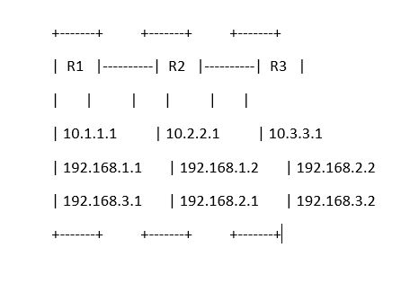

# Static Routes Lab

This repository contains a Packet Tracer lab demonstrating the configuration of **static routes** between three routers.

## 📌 Topology
- **R1 ↔ R2 ↔ R3**
- Networks:
  - R1: `10.1.1.1`, `192.168.1.1`, `192.168.3.1`
  - R2: `10.2.2.1`, `192.168.1.2`, `192.168.2.1`
  - R3: `10.3.3.1`, `192.168.2.2`, `192.168.3.2`



## ⚙️ Files
- **Static-Routes.pkt** → Packet Tracer lab file  
- **network-diagram.jpg** → Topology diagram  

## 🚀 How to Use
1. Download and open the `.pkt` file with Cisco Packet Tracer.
2. Configure static routes on each router:
   - **R1**
     ```bash
     ip route 192.168.2.0 255.255.255.0 10.1.1.2
     ip route 192.168.3.0 255.255.255.0 10.1.1.2
     ```
   - **R2**
     ```bash
     ip route 192.168.3.0 255.255.255.0 10.3.3.2
     ip route 192.168.1.0 255.255.255.0 10.1.1.1
     ```
   - **R3**
     ```bash
     ip route 192.168.1.0 255.255.255.0 10.3.3.1
     ip route 192.168.2.0 255.255.255.0 10.3.3.1
     ```

## 🛡️ Purpose
This lab helps students and professionals practice:
- Static routing
- IP addressing
- Packet Tracer network simulations
